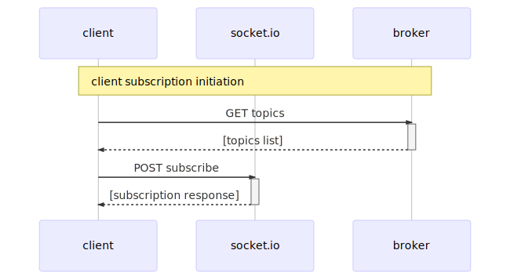
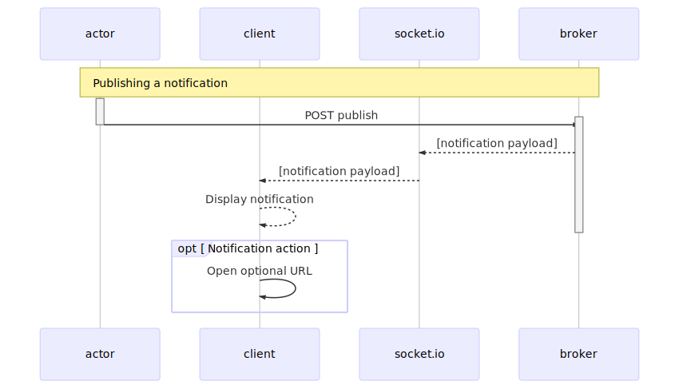

# Notification Server/Client Proof of Concept

This repository is a proof of concept example of how a notification system could be built using the following technologies:

-   Electron
-   Angular 7
-   SSL authentication

## Prerequisites

-   NodeJS
-   AWS account

## Components

This is a lerna-based monorepo with a server and app package.

### @cricket/server

The server is a koa-based HTTPS service

#### Accessing server via curl

Included is a self-signed cert for the "application". The server enforces client-side PKI authentication so you must supply your cert.

```bash
curl --cert certs/app/app.local.crt --key certs/app/app.local.key --cacert certs/ca/myCA.pem https://server.local:3001/
```

**Triggering a notification via curl**

```bash
curl -X POST --cert certs/app/app.local.crt --key certs/app/app.local.key --cacert certs/ca/myCA.pem -d '{ "eventName":"news", "data":{"level":"info","message":"this is from curl"}}' -H 'Content-Type: application/json' https://server.local:3001/publish
```

Alternatively, you can invoke curl using the included shorthand npm script:

The following sends the message `This is an example notification 🔥` to the event name called `news`.

```bash
npm run send news 'This is an example notification 🔥'
```

### @cricket/app

The app is built on in Angular and packaged in electron. It interfaces with the server via the socket.io client and interacts with the user via native OS notifications.

## Notification Workflows

### Client subscription initiation



### Publishing a notification


