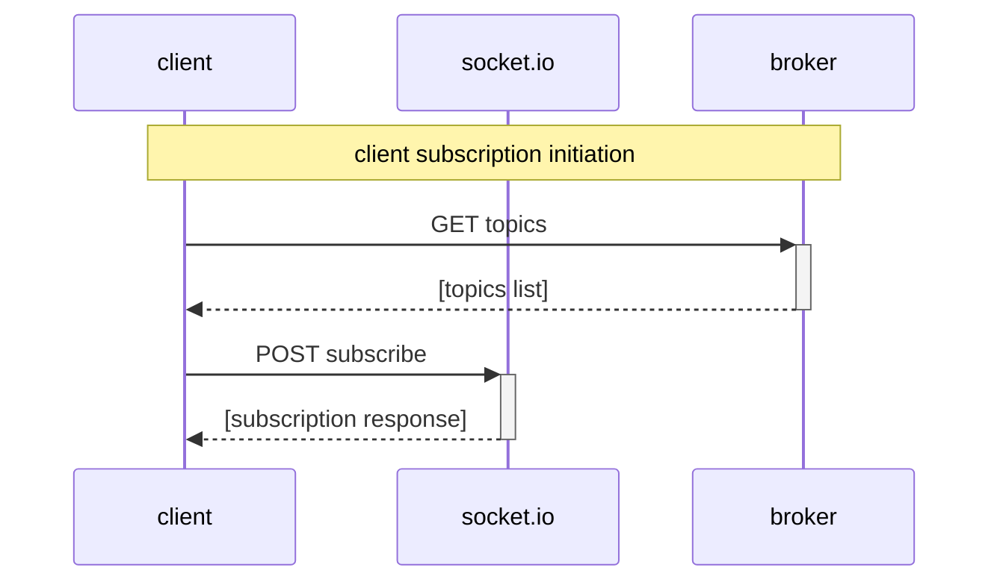

## Mermaid Diagrams

### Client subscription initiation



### Publishing a notification

```mermaid
sequenceDiagram
    participant actor
    participant client
    participant socket.io
    participant broker
    Note over actor, broker: Publishing a notification
    activate actor
    actor->>+broker: POST publish
    deactivate actor
    broker-->>socket.io: [notification payload]
    socket.io-->>client: [notification payload]
    client-->>-client: Display notification
opt Notification action
    client->>client: Open optional URL
end
```
